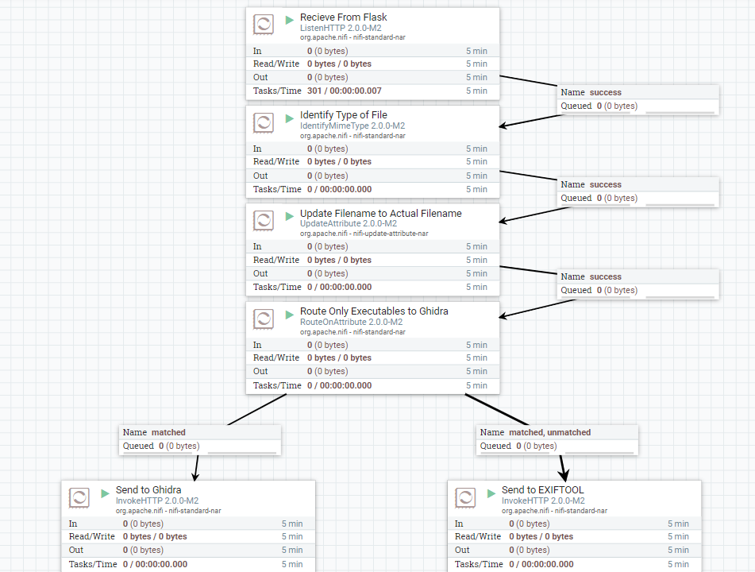
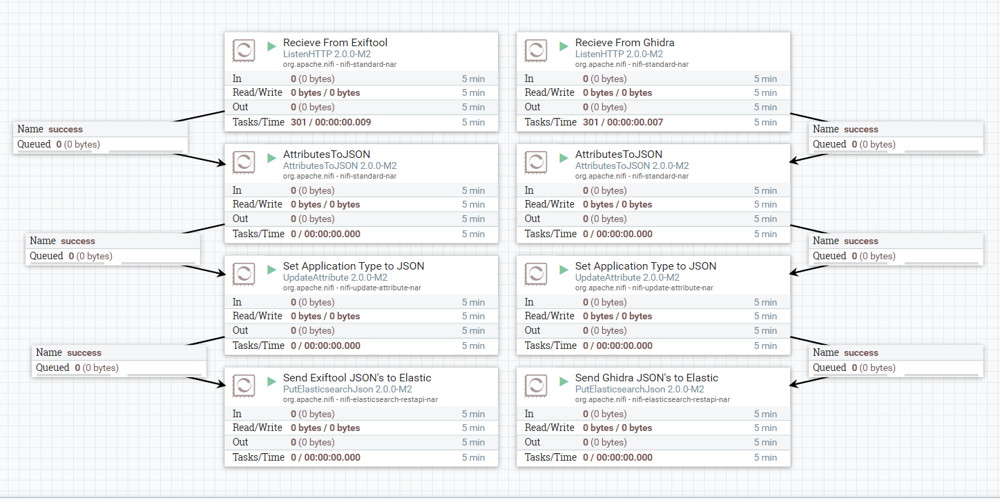

# MITRE-FI
A NiFi flow for data preprocessing, routing for data analysis, and uploading metadata to ElasticSearch

Written by: `Rithvik Bonagiri and Advik Sachdeva`

## Purpose
This flow is used for an internal malware detection tool for MITRE as a part of the UMD App Development Club MITRE Team. The flow does data pre-processing and routing of potential malware files to analyzers and stores results in an elasticsearch database using REST API calls from NiFi processers.

## NiFi
This flow takes in a file (sent by a flask website), does data pre-processing such as identifying the MIME type and updating the filename, sends all files to Exiftool, and then routes only the executables to Ghidra for analysis. The flow then recieves files from both endpoints, converts them to JSON, and sends them to different ElasticSearch indices

## Installation
### Nifi Installation
Install `NiFi 2.0.0-M2` and download the Mitre_Fi flow definition. Once NiFi is loaded, add a Process Group to the flow, and under process group name upload the definition file. Sensitive values such as certificates for Ghidra, Exiftool, and ElasticSearch will have to be manually configured unless using helm charts.

### ElasticSearch Installation
Install `ElasticSearch latest` and set NiFi's ElasticSearch Client Controller to match your own ElasticSearch parameters.

## CURL Requests for Testing
### Sending File to NiFi for Analysis
`curl --location 'http://*NiFi Location*:7776/upload' -X POST --form 'file=@*File Name*'`
### Adding a File to ElasticSearch Index
`curl -k --location '*Elastic Address Here*' -u '*username:password*' -H 'Content-Type: application/json' -X POST *Elastic Address Here*/search-exiftool-output/doc?pretty -d *Your File Here*`

Either upload a JSON file using `@filename.json`, or create json directly inside ` '{ Your JSON Here }' `
### Searching for Particular File in ElasticSearch Index
`curl -k --location '*Elastic Address Here*' -u '*username:password*' -H 'Content-Type: application/json' -X POST *Elastic Address Here*/search-exiftool-output/_search?pretty -d '*Your Query Here*'` 

You can replace `search-exiftool-output` with `search-ghidra-output` to check the Ghidra metadata output. Refer to ElasticSearch documentation in order to construct desired query

## NiFi Flow
### Routing For Metadata Analysis

### Sending to ElasticSearch

